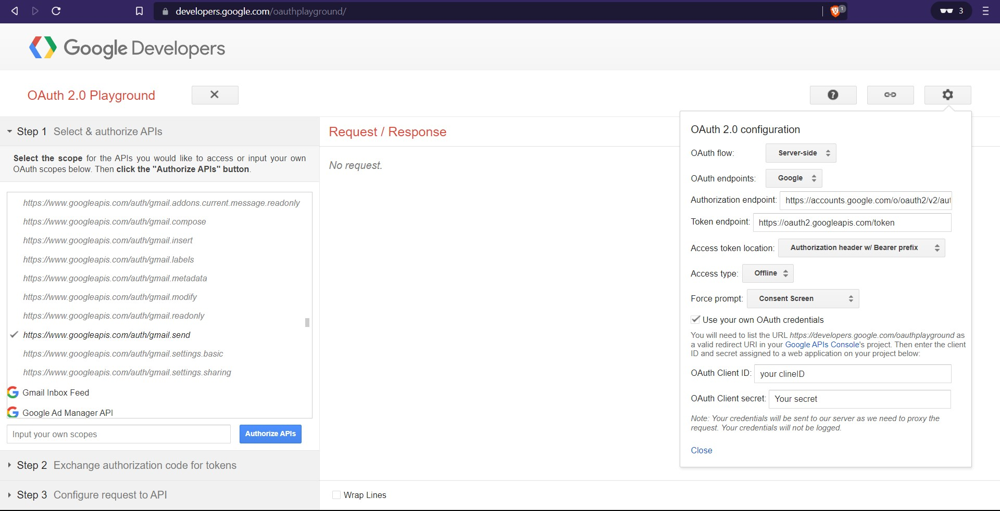

# Get GMAIL API Token

1. Logon to https://console.cloud.google.com/
2. Create new ProJect or Use existing Project.
3. select Project from Top Left middle Menu
3. Enable GMAIL API from Navigation Menu --> APIs and Services --> Library
4. Create OAuth consent screen from from Navigation Menu --> APIs and Services -->  OAuth consent screen
    * Select External (Internal in case organization)
        *  Fill the App Name, User supporting email, Developer contact information
        *   ADD OR REMOVE SCOPES --> send (search for send) and add it
        * Test users --> ADD users --> enter your login email (Add it)
        * Verify once again.  
4. Create OAuth Client Ids from Navigation Menu --> APIs and Services --> Credentials
    * CREATE CREDENTIALS --> OAuth Client ID
        * Application Type --> Web application (depends on you application type)
        * Name (Optional can keep given by google)
        * Authorized redirect URI --> `https://developers.google.com/oauthplayground` (add this)

5. Now ClientID and Client Secret are created. To get Refresh Token 
    * Go to `https://developers.google.com/oauthplayground/`
    * fill required data as below

        
    * Authorize APIs and give access to it.
    * It will redirected to oauthPlayground. if we click on `Exchange authorization code for tokens`. we'll get RefreshToken along with access Token.

6. we can ClientId,ClientSecret,RedirectURI,RefreshToken to send mails.